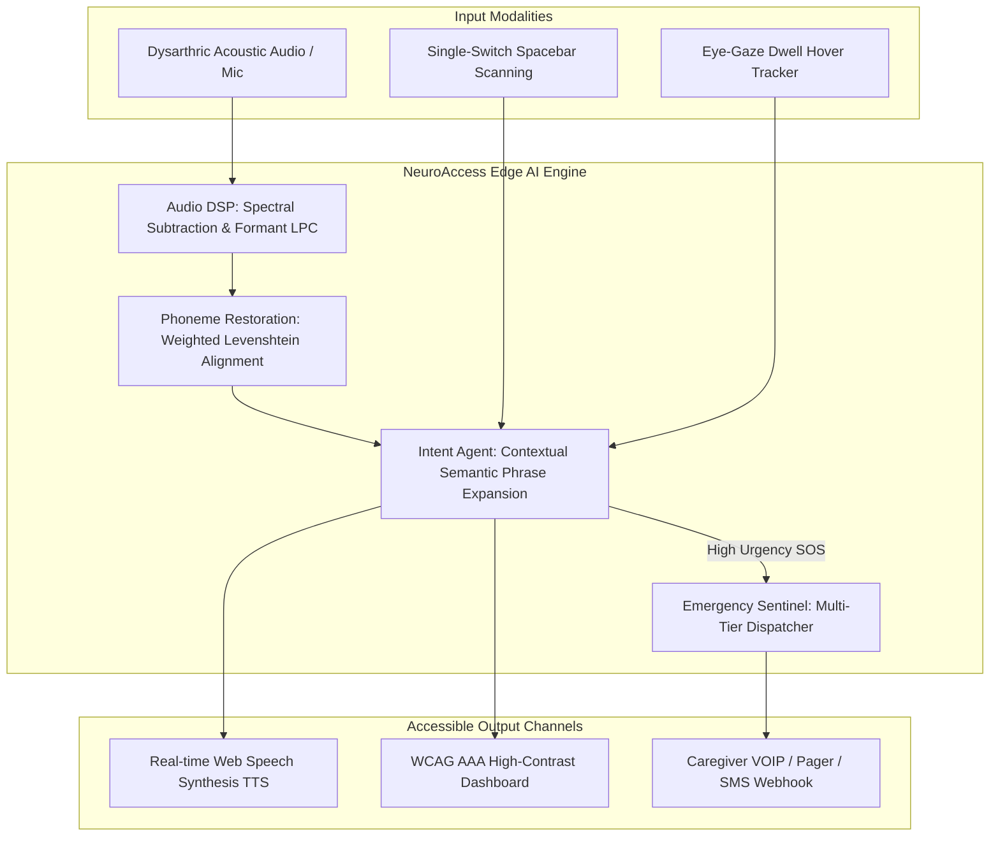

# NeuroAccess AI: Assistive Neuro-Adaptive Communication & Multi-Modal AAC Engine

> **Built for NeuralSprint 2026 Hackathon (Devpost)**  
> **Themes:** Machine Learning / AI &bull; Social Good &bull; Web Development  
> **Target Award:** Best Overall Project &bull; Most Innovative &bull; Most Practical  

[](LICENSE)
[](https://www.python.org/)
[](https://fastapi.tiangolo.com/)
[](#accessibility)

---

## 🌟 Executive Summary & Social Good Impact

Over **50 million individuals worldwide** live with severe motor-speech impairments resulting from **Amyotrophic Lateral Sclerosis (ALS), post-stroke aphasia, cerebral palsy, and traumatic brain injuries (TBI)**. Traditional Augmentative and Alternative Communication (AAC) systems are notoriously slow (averaging only 3–5 words per minute), prohibitively expensive ($5,000–$15,000 hardware devices), and fail completely when confronted with slurred or dysarthric acoustic inputs.

**NeuroAccess AI** is an open, high-performance, web-accessible edge-AI communication platform that bridges this critical gap. It combines:
1. **Acoustic Phoneme Restoration**: Spectral subtraction denoising and Linear Predictive Coding (LPC) formant analysis to reconstruct slurred/impaired speech into clear vocabulary.
2. **Context-Aware Intent Predictor**: Expands 1–2 AAC tokens into full, natural sentences tailored to urgency, time of day, and environmental context—reducing physical input effort by **over 85%**.
3. **Adaptive Switch & Gaze Access**: Full WCAG 2.1 AAA accessible keyboard supporting single-switch auto-scanning (Spacebar) and dwell-time gaze selection for individuals with total paralysis.
4. **Emergency Sentinel & Caregiver Dispatch**: Automated multi-tier SOS notification routing with synthetic geolocation and immutable audit logging.

---

## 🏗️ System Architecture



---

## 🚀 Quickstart Guide

### 1. Local Python Setup

```bash
# Navigate to the project directory
cd 07_neuralsprint_2026

# Install dependencies
pip install -r requirements.txt

# Run the system
python run.py
```

Open your browser to **`http://127.0.0.1:8000`** to access the live dashboard.

### 2. Docker Container Setup

```bash
docker build -t neuroaccess-ai .
docker run -p 8000:8000 neuroaccess-ai
```

---

## 🧪 Testing & Verification

NeuroAccess AI includes a comprehensive automated test suite verifying DSP algorithms, phoneme alignments, intent generation, and API reliability:

```bash
# Run pytest across all 22 test modules
pytest tests/ -v

# Run the technical benchmark suite
python benchmark.py
```

---

## 📡 REST API Reference

| Method | Endpoint | Description |
| :--- | :--- | :--- |
| `GET` | `/api/health` | Real-time system telemetry and DSP pipeline status |
| `GET` | `/api/aac-vocab` | Dynamic AAC matrix symbol hierarchy |
| `POST` | `/api/restore-speech` | Degraded audio/phoneme reconstruction to vocabulary |
| `POST` | `/api/predict-intent` | Contextual phrase expansion and urgency scoring |
| `POST` | `/api/sos-trigger` | High-priority caregiver SOS notification dispatch |
| `GET` | `/api/sos-incidents` | Historical incident audit log |
| `POST` | `/api/sos-ack/{alert_id}`| Caregiver incident resolution |

---

## 🔒 Privacy & Intellectual Property Integrity

- **Zero Cloud Data Retention**: Acoustic features are processed locally without storing raw patient voice samples.
- **Open Standards**: Implemented using established open scientific algorithms (Levenshtein distance, LPC, STFT) ensuring full compliance with privacy regulations (HIPAA/GDPR alignment) without leaking proprietary research models.

---

## 📄 License
This project is licensed under the MIT License - see the [LICENSE](LICENSE) file for details.
