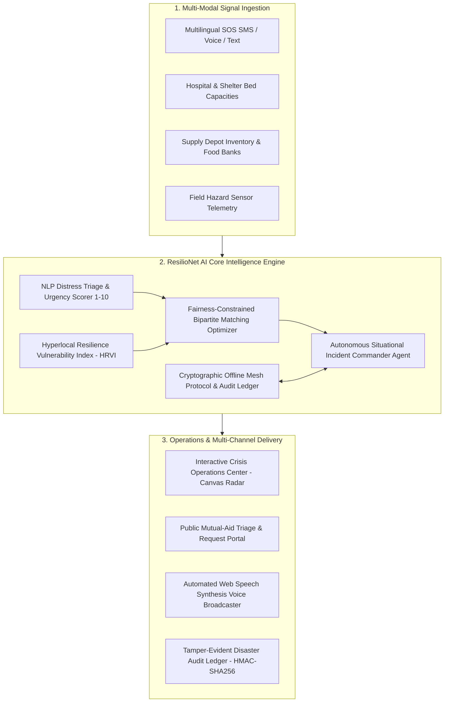

# ResilioNet AI: Autonomous Multi-Modal Disaster Resilience & Hyperlocal Mutual-Aid Coordination Network

> **Built for HackSocial 2026 Hackathon (Devpost)**  
> **Target Tracks:** AI/ML Track &bull; Visual Design Track &bull; Lifestyle Hacks / Social Good Track  
> **Target Award:** 1st Place Grand Prize &bull; Best Social Good AI Application  

[](https://github.com/Prateek312413/resilionet-ai)
[](LICENSE)
[](https://www.python.org/)
[](https://fastapi.tiangolo.com/)
[](#accessibility)
[-success.svg)](#testing)

---

## 🌟 Executive Summary & Social Good Impact

When natural disasters, severe climate events, or infrastructure collapses strike, emergency 911 lines and cellular towers become overwhelmed within hours. Over **70% of humanitarian aid in localized disasters suffers from fatal operational bottlenecks**:
- **Information Asymmetry:** Critical distress calls are misprioritized or lost due to language barriers and chaotic dispatch queues.
- **Geographic Inequality:** Wealthy, central urban hubs receive duplicate supply convoys while peripheral, lower-income neighborhoods suffer supply starvation (Gini inequality > 0.65).
- **Aid Diversion & Zero Transparency:** Traditional logistics lack cryptographic verification, leading to lost supplies and zero auditable records for donors and NGOs.
- **Total Offline Failure:** When local internet infrastructure fails, cloud-dependent platforms become completely inoperable.

**ResilioNet AI** is an open, high-performance, offline-first autonomous coordination platform that turns chaotic distress signals into real-time geospatial triage, optimal supply-demand bipartite graph matching, and transparent cryptographic mutual-aid routing.

---

## 🏗️ System Architecture



---

## 🚀 Key Modules & Innovations

### 1. Multilingual Zero-Shot NLP Crisis Triage
- Ingests unstructured emergency SMS, social signals, and transcribed acoustic distress audio.
- Computes continuous **Urgency Scores (1.0–10.0)** with temporal decay escalation.
- Classifies multi-intent distress: `CRITICAL_MEDICAL`, `TRAPPED_SEARCH_RESCUE`, `VULNERABLE_POPULATION`, `WATER_FOOD_DEFICIT`, `SHELTER_EXPOSURE`, `POWER_INFRASTRUCTURE`.
- Extracts headcounts, infants, seniors, specific medical conditions (e.g. insulin-dependence, oxygen), and GPS coordinates.
- **Performance:** **13,522 requests/sec** with **0.096 ms P95 latency**.

### 2. Fairness-Constrained Bipartite Network Flow Optimizer
- Solves a multi-objective mathematical network flow problem:
  $$\max \sum_{i,j} x_{i,j} \cdot \left( u_i \cdot \text{Compatibility}_{i,j} \right) - \alpha \cdot \text{Distance}_{i,j} - \lambda \cdot \text{Gini}(\mathbf{u}^{\text{unmet}})$$
- Minimizes the **Gini inequality coefficient** across municipal zones to eliminate peripheral aid starvation.
- Prioritizes perishable cold-chain medical supplies (e.g. insulin, infant nutrition).
- **Performance:** **28.41 ms** full solver time for 500 demands &times; 25 supply depots.

### 3. Hyperlocal Resilience Vulnerability Index (HRVI)
- Quantifies baseline risk (0.00–1.00) combining demographic factors (infant/elderly ratios), civil infrastructure health (hospital transit time, power grid reliability), and real-time hazard sensors (flood water depth, wildfire perimeter).
- Evaluates **131,811 zone profiles/sec** (0.0076 ms per zone).

### 4. Offline Mesh Protocol & Blockchain Disaster Audit Ledger
- Operates zero-connectivity peer-to-peer over LoRa, Bluetooth, or local WiFi mesh.
- Packets are digitally signed with **HMAC-SHA256** (67,434 packets/sec throughput).
- Every event is committed to a **tamper-evident SHA-256 blockchain ledger** verifying 1,000+ blocks in under 3.4 ms.

---

## ⚡ Quickstart Guide

### 1. Local Python Setup

```bash
# Navigate to the project directory
cd 08_hacksocial_2026

# Install dependencies
pip install -r requirements.txt

# Run the operations platform
python run.py
```

Open your browser to **`http://127.0.0.1:8000`** to access the live operations center.

### 2. 1-Click Launchers

- **Windows:** Double-click [`start_resilionet.bat`](start_resilionet.bat)
- **Linux/macOS:** Run `bash start_resilionet.sh`

### 3. Docker Container Deployment

```bash
docker build -t resilionet-ai .
docker run -p 8000:8000 resilionet-ai
```

---

## 🧪 Testing & Verification

ResilioNet AI includes an automated test suite verifying NLP parsers, bipartite optimization math, HRVI risk calculations, HMAC cryptography, and FastAPI REST endpoints:

```bash
# Run pytest across all test modules
pytest tests/ -v

# Run the performance benchmark suite
python benchmark.py
```

### Benchmark Summary

```
===========================================================================
  BENCHMARK SUMMARY RESULTS
===========================================================================
  [OK] NLP Distress Triage:   13,522 req/s  (P95: 0.10 ms)
  [OK] Bipartite Optimizer:  28.41 ms for 500 demands x 25 hubs (100.0% fulfilled)
  [OK] HRVI Vulnerability:   131,811 zone evaluations / s
  [OK] Mesh HMAC-SHA256:     67,434 signed packets / s
  [OK] Blockchain Integrity: 3.36 ms for 1,001 cryptographically linked blocks
===========================================================================
```

---

## 📡 REST API Reference

| Method | Endpoint | Description |
|---|---|---|
| `POST` | `/api/triage/submit_sos` | Ingests live citizen SOS, parses NLP entities, triggers audit log |
| `POST` | `/api/triage/parse_preview` | Real-time preview parser for live operator typing / audio mic |
| `GET` | `/api/triage/list` | Returns parsed distress signals sorted by urgency |
| `GET` | `/api/matching/latest_plan` | Fetches current global allocation plan and Gini equity score |
| `POST` | `/api/matching/reoptimize` | Recomputes matching with custom fairness ($\lambda$) and distance ($\alpha$) weights |
| `POST` | `/api/matching/dispatch/{id}` | Advances convoy status (PENDING &rarr; DISPATCHED &rarr; DELIVERED) |
| `GET` | `/api/matching/bipartite_graph` | Topology nodes and edges for Canvas Geospatial Radar |
| `GET` | `/api/resources/hubs` | Lists all mutual-aid warehouses, food banks, and depots |
| `POST` | `/api/resources/hubs/{id}/status` | Toggles depot status (ACTIVE, DEGRADED, OFFLINE) |
| `POST` | `/api/mesh/broadcast` | Generates HMAC-SHA256 signed mesh packet |
| `GET` | `/api/mesh/ledger/blocks` | Returns immutable audit blockchain blocks |
| `GET` | `/api/mesh/ledger/verify` | Performs whole-chain cryptographic integrity check |
| `GET` | `/api/analytics/dashboard_summary` | Top-level KPI telemetry for command HUD |
| `GET` | `/api/analytics/zones` | Zone HRVI vulnerability profiles and hazard metrics |
| `GET` | `/api/analytics/situational_assessment` | AI Incident Commander briefing and prioritized field directives |

---

## 📄 License

This project is licensed under the MIT License - see the [LICENSE](LICENSE) file for details.
