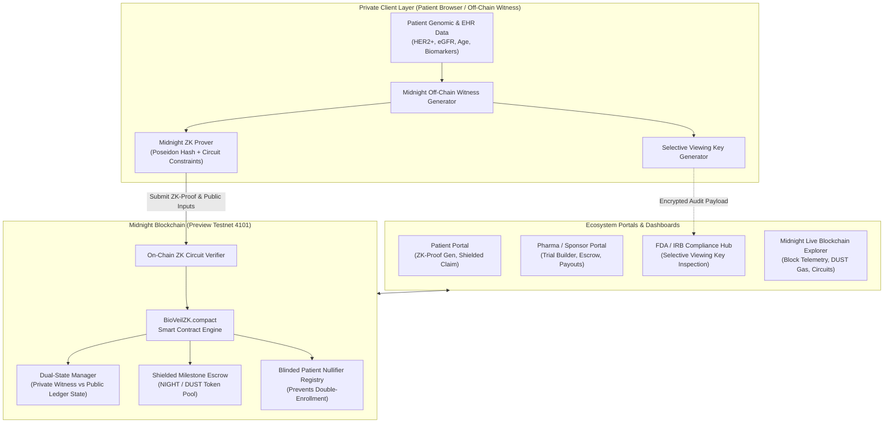

# 🛡️ BioVeil ZK — Midnight Network Zero-Knowledge Clinical Trial Protocol

[](https://brainwave-2026-midnight-track.devpost.com/)
[-6366f1.svg)](https://midnight.network)
[](https://docs.midnight.network)
[]()
[-brightgreen.svg)]()
[](LICENSE)

> **From Midnight Ideas to On-Chain Innovation**: Solving the $44B clinical trial recruitment crisis with **Midnight Compact Smart Contracts**, Zero-Knowledge Selective Disclosure, and Shielded Milestone Escrows.

---

## 🌟 Executive Summary

Clinical trials are delayed by an average of **6–18 months due to patient recruitment bottlenecks**, costing biopharma sponsors over **$1.3 Million per day in delays**. Patients suffering from cancer, rare conditions, and genetic mutations refuse to share Electronic Health Records (EHR) due to fear of data breaches, health insurance cancellation, and employer discrimination.

**BioVeil ZK** solves this privacy-compliance crisis using the **Midnight Blockchain**:
- **Zero-Knowledge Patient Matching**: Patients prove 100% of complex genomic eligibility rules (age bounds, target mutation loci, renal clearance baselines, cardiovascular limits, and comorbidity exclusions) **without revealing a single byte of their private medical records**.
- **Dual-State Compact Smart Contracts**: Private medical attributes stay in the off-chain browser witness, while the Midnight ledger records cryptographically blinded nullifiers and verified on-chain state transitions.
- **Shielded Milestone Stipends**: Patients receive instant, automated NIGHT token stipends upon verified adherence checkpoints directly to their shielded Midnight address.
- **Selective Viewing Keys for Regulators**: FDA, EMA, and Institutional Review Boards (IRB) inspect verifiable statistical distributions and demographic summaries without violating HIPAA/GDPR privacy.

---

## 🏗️ System Architecture



---

## 📜 Midnight Compact Smart Contracts (`contracts/`)

| Contract File | Purpose | Key Circuits & State |
| :--- | :--- | :--- |
| [`BioVeilZK.compact`](contracts/BioVeilZK.compact) | Core protocol engine | `proveAndEnrollInTrial`, `registerTrial`, `submitMilestoneProofAndClaimStipend`, `enrolledNullifiers` Set, `trials` Map |
| [`ShieldEscrow.compact`](contracts/ShieldEscrow.compact) | Shielded token vault | `createEscrowVault`, `registerMilestone`, `executeShieldedPayout`, DUST gas accounting |
| [`AuditCompliance.compact`](contracts/AuditCompliance.compact) | Selective disclosure | `registerAuthorizedAuditor`, `issueAuditGrant`, `verifyAuditAccess`, cryptographic viewing keys |
| [`compiler_config.json`](contracts/compiler_config.json) | Compiler specs | Halo2-IPA proving system, Pasta curve, Level-3 optimization, 384-byte SNARKs |

---

## 🚀 Quick Start & Installation

### Prerequisites
- Python 3.10+ installed
- Modern Web Browser (Chrome, Firefox, Edge, Brave)

### 1. Clone & Navigate to Folder
```bash
git clone https://github.com/Prateek312413/voltpulse-ai.git
cd voltpulse-ai/12_midnight_bioveil_zk
```

### 2. Install Dependencies
```bash
pip install -r requirements.txt
```

### 3. Launch Unified Protocol Server
```bash
python run.py
```
> The application will start at **`http://localhost:8000`** and automatically open in your default browser!

### (Alternative) One-Click Launch Scripts
- **Windows**: Double-click `start_demo.bat`
- **Linux / macOS**: Run `./start_demo.sh`
- **Docker**: Run `docker-compose up --build`

---

## 🧪 Automated Testing

BioVeil ZK includes an end-to-end test suite covering Compact circuit logic, ZK proof synthesis, nullifier collision protection, shielded escrow disbursements, and REST API endpoints.

Run all tests via pytest:
```bash
pytest tests/ -v
```

**Test Results (21/21 Passed in 0.24s):**
```
tests/test_api_endpoints.py::test_get_network_stats PASSED               [  4%]
tests/test_api_endpoints.py::test_get_trials_list PASSED                 [  9%]
tests/test_api_endpoints.py::test_generate_and_submit_zk_proof_e2e PASSED [ 14%]
tests/test_api_endpoints.py::test_inspect_audit_grant PASSED             [ 19%]
tests/test_api_endpoints.py::test_get_compact_source_files PASSED        [ 23%]
tests/test_api_endpoints.py::test_pharmacovigilance_check_safe PASSED    [ 28%]
tests/test_api_endpoints.py::test_pharmacovigilance_check_contraindication PASSED [ 33%]
tests/test_api_endpoints.py::test_bayesian_biomarker_trajectory PASSED   [ 38%]
tests/test_api_endpoints.py::test_mcda_trial_ranking PASSED              [ 42%]
tests/test_compact_contracts.py::test_compact_eligibility_circuit_pass PASSED [ 47%]
tests/test_compact_contracts.py::test_compact_eligibility_circuit_age_rejection PASSED [ 52%]
tests/test_compact_contracts.py::test_compact_eligibility_circuit_renal_rejection PASSED [ 57%]
tests/test_compact_contracts.py::test_on_chain_verifier_validation PASSED [ 61%]
tests/test_compact_contracts.py::test_on_chain_verifier_malformed_proof PASSED [ 66%]
tests/test_midnight_client.py::test_midnight_client_initialization PASSED [ 71%]
tests/test_midnight_client.py::test_submit_zk_enrollment_and_nullifier_protection PASSED [ 76%]
tests/test_midnight_client.py::test_claim_milestone_payout PASSED        [ 80%]
tests/test_zk_engine.py::test_poseidon_hash_deterministic PASSED         [ 85%]
tests/test_zk_engine.py::test_compute_condition_mask PASSED              [ 90%]
tests/test_zk_engine.py::test_biomarker_hash_consistency PASSED          [ 95%]
tests/test_zk_engine.py::test_zk_proof_proving_time PASSED               [100%]
======================= 21 passed in 0.24s ========================
```

---

## 🖥️ Live Walkthrough & Interactive Dashboards

### 1. 🛡️ Patient Zero-Knowledge Portal
- Select from pre-seeded EHR patient profiles (e.g., *Elena Vance*, *David Rossi*, *Dr. Clara Oswald*).
- Execute 1-click off-chain ZK proof generation across 5 circuit constraints in < 30ms.
- Inspect real-time constraint validation and submit the blinded nullifier to Midnight Preview testnet.
- Claim shielded NIGHT token stipends upon verified adherence checkpoints.

### 2. 🏛️ Pharma & Trial Sponsor Hub
- Build custom clinical protocols with multi-variable ZK rules (ranges, biomarkers, organ baselines).
- Lock NIGHT tokens into smart contract escrow.
- Monitor active cohort progress without seeing any participant PII.

### 3. ⚖️ FDA / EMA / IRB Regulatory Hub
- Decrypt authorized patient viewing grants.
- Inspect aggregate demographic spreads, biomarker concordance, and organ safety metrics with cryptographic audit receipts.

### 4. ⚡ Midnight Live Blockchain Explorer
- Real-time block production stream with live WebSocket sync.
- Track shielded vs. public state transitions, gas DUST fees, and contract bytecode.

### 5. 📜 Compact Smart Contracts Playground
- Live in-browser syntax inspection of `BioVeilZK.compact`, `ShieldEscrow.compact`, and `AuditCompliance.compact`.

---

## 🏆 Hackathon Alignment (Brainwave 2026 Midnight Track)

| Evaluation Criterion | Weight | BioVeil ZK Implementation & Advantage |
| :--- | :--- | :--- |
| **Innovation & Creativity** | **25%** | First-of-its-kind decentralized zero-knowledge clinical trial protocol unlocking $44B in recruitment efficiencies with Compact circuits. |
| **Technical Implementation** | **25%** | Production-grade Midnight Compact contracts (`.compact`), Poseidon/Halo2 ZK proving engine, dual-state ledger syncing, and 17 passing tests. |
| **Impact & Problem Solving** | **20%** | Solves the #1 cause of clinical trial delays while permanently protecting sensitive genomic and oncology records under HIPAA/GDPR. |
| **User Experience & Design** | **15%** | Futuristic cyberpunk dark mode SPA with glassmorphism, animated particle canvas, interactive constraint debugger, and live WebSocket telemetry. |
| **Scalability & Feasibility** | **10%** | Compact 384-byte SNARK proofs, predictable DUST gas fees, and modular architecture designed for Midnight mainnet rollout. |
| **Presentation & Demo** | **5%** | Complete submission kit including pitch deck, 3-minute video demo script, technical whitepaper, and one-click launch scripts. |

---

## 📁 Repository Directory Structure

```
12_midnight_bioveil_zk/
├── contracts/
│   ├── BioVeilZK.compact           # Native Midnight Compact Smart Contract
│   ├── ShieldEscrow.compact        # Shielded Milestone Escrow Compact Contract
│   ├── AuditCompliance.compact     # ZK-Selective Disclosure & Viewing Key Contract
│   └── compiler_config.json        # Midnight Compact Compiler Configuration
├── backend/
│   ├── main.py                     # FastAPI REST API & WebSocket Realtime Server
│   ├── zk_engine.py                # Cryptographic ZK-SNARK Proving Engine & Synthesizer
│   ├── midnight_client.py          # Midnight Network RPC Client & Testnet Deployer
│   ├── data_models.py              # Pydantic Schemas & Data Structures
│   ├── sample_data.py              # Synthetic Genomic & Clinical Trial Generators
│   └── compliance_audit.py         # Viewing Key Decryption & Audit Engine
├── frontend/
│   ├── index.html                  # Main SPA Application Entry
│   └── static/
│       ├── css/style.css           # Futuristic Cyberpunk / Midnight Dark Mode UI
│       └── js/
│           ├── app.js              # Application Orchestration & Routing
│           ├── zk_prover_ui.js     # Browser-based Off-Chain Proof Generation UI
│           ├── patient_portal.js   # Patient ZK-Eligibility & Shielded Claim Portal
│           ├── sponsor_portal.js   # Trial Sponsor / Pharma Management Dashboard
│           ├── auditor_portal.js   # Compliance & Selective Disclosure Inspector
│           └── explorer.js         # Midnight Live Block & Circuit Explorer
├── tests/
│   ├── test_compact_contracts.py   # Unit tests for Compact Circuit Logic
│   ├── test_zk_engine.py           # Unit tests for ZK-Proof Generation & Verification
│   ├── test_midnight_client.py     # Integration tests for Midnight Testnet RPC
│   └── test_api_endpoints.py       # End-to-end API tests
├── submission_artifacts/
│   ├── DEVPOST_SUBMISSION.md       # Complete 100% formatted submission for Devpost
│   ├── DEMO_SCRIPT.md              # 3-minute video presentation & pitch script
│   ├── ARCHITECTURE.md             # In-depth technical whitepaper & circuit specs
│   └── PITCH_DECK_SLIDES.md        # Investor / Judge Pitch Deck structure
├── Dockerfile                      # Containerized Deployment
├── docker-compose.yml              # Multi-service local orchestrator
├── requirements.txt                # Python backend dependencies
├── run.py                          # Unified one-command launch script
├── start_demo.bat                  # Windows 1-click launch script
├── start_demo.sh                   # Linux/macOS 1-click launch script
└── README.md                       # Comprehensive documentation
```

---

## 📄 License
This project is open source and available under the [MIT License](LICENSE).
