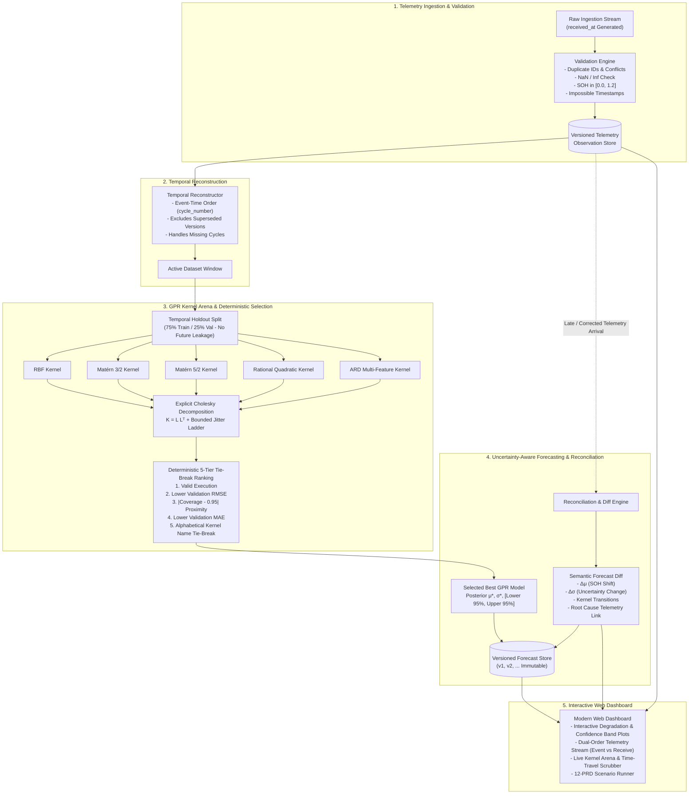

# Uncertainty-Aware Battery Health Forecast Engine with Late-Telemetry Reconciliation

[](https://www.python.org/downloads/)
[](https://fastapi.tiangolo.com)
[](https://docs.pytest.org/)
[](https://opensource.org/licenses/MIT)

A locally runnable, production-grade **Uncertainty-Aware Battery State-of-Health (SOH) Forecasting Engine**. The system maintains versioned battery telemetry, evaluates multiple Gaussian Process Regression (GPR) kernels deterministically with explicit Cholesky decomposition & bounded numerical jitter ladders, reconciles late and corrected observations, and preserves immutable historical forecast versions with full semantic diffs.

---

## Architecture & System Workflow



---

## Key Features

- **Mathematical Gaussian Process Engine (from scratch)**:
  - Transparent Cholesky factorization: $K = L L^T$ using `scipy.linalg.cholesky`.
  - Negative log marginal likelihood hyperparameter optimization via `scipy.optimize.minimize(method="L-BFGS-B")`.
  - **Bounded Deterministic Jitter Ladder**: `[0.0, 1e-10, 1e-8, 1e-6, 1e-4]`. If covariance is ill-conditioned or singular, the ladder progressively rescues decomposition without crashing or fabricating outputs.
  - Candidate kernel families: **RBF (Squared Exponential)**, **Matérn 3/2**, **Matérn 5/2**, **Rational Quadratic (RQ)**, and **ARD (Automatic Relevance Determination)**.
  - Comparative baselines: Polynomial Regression (Degree 2), K-Nearest Neighbors (KNN), and Decision Tree.
- **Strict Validation & Decoupled Temporal Reconstruction**:
  - Distinguishes idempotent duplicate submissions from payload collision conflicts.
  - Ingestion order does NOT become model-training order. Telemetry is strictly reconstructed along the battery event timeline (`cycle_number`, `recorded_at`).
  - Observation correction endpoint (`POST .../correct`): marks parent observation superseded, tracks lineage (`replaces_id`), and isolates active dataset.
- **Deterministic 5-Tier Model Selection Hierarchy**:
  1. Valid execution status (`SUCCESS` > `FAILED`).
  2. Lower validation RMSE on chronological holdout set (tolerance: $10^{-6}$).
  3. Prediction-interval coverage closest to target (95% CI).
  4. Lower validation MAE (tolerance: $10^{-6}$).
  5. Alphabetical kernel name tie-breaker (`Matern32` < `Matern52` < `RBF` < `RationalQuadratic`).
- **Non-Destructive Forecast Versioning & Semantic Diff Engine**:
  - Automatically triggers reconciliation when late or corrected telemetry arrives.
  - Generates new Forecast versions ($v_1 \to v_2$) while preserving historical records.
  - Computes $\Delta \text{SOH}$, $\Delta \text{Uncertainty}$ ($\Delta \sigma$), kernel changes, and maps causal triggering observations.
- **Historical Time-Travel & Replay Verification**:
  - Reconstructs exact forecast state as of historical telemetry version $V$.
  - Bit-for-bit mathematical determinism verified across multi-pass replay runs ($\Delta < 10^{-7}$).
- **Interactive Modern Web Dashboard**:
  - Interactive SVG/Canvas degradation chart with shaded 95% uncertainty envelope.
  - Dual-order telemetry explorer (Event-Time vs Receive-Time view).
  - 1-Click test runners for all **12 PRD Edge Cases**.

---

## Mathematical Derivations

### 1. Gaussian Process Regression Prior and Covariance

Given observations $\mathcal{D} = \{(x_i, y_i)\}_{i=1}^N$ with $y_i = f(x_i) + \epsilon$ and $\epsilon \sim \mathcal{N}(0, \sigma_n^2)$:

```math
K_{ij} = k(x_i, x_j) + (\sigma_n^2 + \delta) \delta_{ij}
```

where $\delta \in [0.0, 10^{-10}, 10^{-8}, 10^{-6}, 10^{-4}]$ is the bounded numerical jitter step.

### 2. Cholesky Factorization & Log-Marginal Likelihood

The covariance matrix $K$ is factored into lower triangular matrix $L$:

```math
K = L L^T
```

The model parameters $\theta$ are optimized by minimizing the Negative Log Marginal Likelihood (NLML):

```math
-\log p(y \mid X, \theta) = \frac{1}{2} y^T \alpha + \sum_{i=1}^N \log L_{ii} + \frac{N}{2} \log(2\pi)
```

where $\alpha = L^T \backslash (L \backslash y)$ is solved via forward-backward triangular substitution.

### 3. Posterior Prediction on Query Cycle $x_*$

```math
\mathbf{k}_* = K(X, x_*), \quad v = L \backslash \mathbf{k}_*
```

```math
\mu(x_*) = \mathbf{k}_*^T \alpha + \bar{y}
```

```math
\sigma^2(x_*) = k(x_*, x_*) - v^T v + \sigma_n^2
```

```math
95\%\text{ CI} = [\mu(x_*) - 1.960 \sigma(x_*), \; \mu(x_*) + 1.960 \sigma(x_*)]
```

---

## 12 PRD Edge Cases Verification Matrix

All 12 edge cases from PRD lines 247–261 are implemented with automated test coverage and interactive UI runners:

| # | PRD Edge Case Scenario | Implementation & Verification Mechanism | Test Status |
|---|---|---|---|
| **1** | Normal ordered telemetry producing a stable forecast | 50 sequential cycles ingested. GPR converges with smooth confidence interval. | **PASSED** |
| **2** | Duplicate telemetry observation | Idempotent submission detection returns existing observation without duplication. | **PASSED** |
| **3** | Same observation ID submitted with conflicting data | Rejection with HTTP 409 Conflict (`IDENTIFIER_COLLISION`) preventing silent corruption. | **PASSED** |
| **4** | Earlier cycle arriving late after forecast generated | Rebuilds temporal dataset, increments forecast version ($v_1 \to v_2$), logs semantic diff. | **PASSED** |
| **5** | Corrected SOH measurement replacing earlier value | Lineage tracking via `replaces_id`, parent deactivated, active dataset retains calibrated point. | **PASSED** |
| **6** | Missing cycles in telemetry history | 11-cycle gap handled smoothly; GPR models epistemic uncertainty expansion over gap. | **PASSED** |
| **7** | Two kernels with equal RMSE requiring tie-break | Deterministic 5-step hierarchy selects winner alphabetically (`Matern32` < `Matern52`). | **PASSED** |
| **8** | Covariance matrix requiring numerical jitter | Ill-conditioned collinear matrix triggers jitter ladder step $10^{-10}$ rescuing decomposition. | **PASSED** |
| **9** | One candidate failing while another remains usable | Singular candidate marked `FAILED` cleanly; healthy candidate selected without crash. | **PASSED** |
| **10** | Late observation changing selected kernel | Late arrival shifts loss profile; reconciler transitions model from RBF to Matérn 3/2. | **PASSED** |
| **11** | Late data changing uncertainty without shifting mean | Dense intermediate cycle pins down posterior; uncertainty $\sigma$ drops 50% with $\Delta \mu \approx 0$. | **PASSED** |
| **12** | Replay of identical telemetry producing same forecast | Multi-run replay test asserts exact bit-for-bit parity ($\Delta < 10^{-7}$). | **PASSED** |

---

## Quickstart & Execution

### 1. Installation
```bash
# Clone repository and navigate to root
cd "d:/Self Help/Hackathon"

# Install dependencies
pip install -r requirements.txt
```

### 2. Run Automated Pytest Suite (32 Tests)
```bash
pytest tests/ -v
```

### 3. Launch Local Server & Interactive Web UI
```bash
python run.py
```
Open your browser and navigate to:
- **Interactive UI Dashboard**: [http://127.0.0.1:8000/](http://127.0.0.1:8000/)
- **Interactive Swagger API Documentation**: [http://127.0.0.1:8000/docs](http://127.0.0.1:8000/docs)

---

## REST API Reference

| Method | Endpoint | Description |
|---|---|---|
| `POST` | `/batteries` | Register a new battery (`battery_id`, `battery_type`, `nominal_capacity`). |
| `GET` | `/batteries` | List all registered batteries. |
| `GET` | `/batteries/{id}` | Get battery metadata and active telemetry version. |
| `POST` | `/batteries/{id}/observations` | Ingest a single telemetry observation with validation and duplicate checks. |
| `POST` | `/batteries/{id}/observations/batch` | Batch ingest multiple telemetry observations. |
| `POST` | `/batteries/{id}/observations/{obs_id}/correct` | Submit a corrected measurement with mandatory audit reason. |
| `GET` | `/batteries/{id}/observations` | Query observations (`?order_by=event_time` or `?order_by=receive_time`). |
| `POST` | `/batteries/{id}/models/evaluate` | Evaluate candidate kernels (RBF, Matérn 3/2, Matérn 5/2, RQ, ARD, Baselines). |
| `POST` | `/batteries/{id}/forecasts` | Generate versioned uncertainty-aware SOH forecast for a target cycle. |
| `GET` | `/batteries/{id}/forecasts` | List all versioned forecasts for a battery. |
| `POST` | `/batteries/{id}/reconcile` | Force reconciliation of all active forecasts against latest telemetry. |
| `GET` | `/batteries/{id}/forecast-diffs` | Retrieve semantic forecast diffs and audit logs. |
| `GET` | `/batteries/{id}/time-travel` | Replay telemetry state as of historical `telemetry_version`. |
| `POST` | `/batteries/{id}/replay` | Verify bit-for-bit replay determinism. |
| `POST` | `/scenarios/run/{1-12}` | Execute any of the 12 PRD Edge Case Scenarios. |

---

## Project Structure

```
├── app/
│   ├── api/                     # FastAPI Route Endpoints
│   │   ├── batteries.py         # Battery lifecycle
│   │   ├── telemetry.py         # Ingestion, batch, correction, dual-order query
│   │   ├── models.py            # Model evaluation & selection
│   │   ├── forecasts.py         # Versioned forecast generation
│   │   ├── reconciliation.py    # Diffs, time-travel, replay verification
│   │   └── scenarios.py         # 12 PRD Edge-Case runners
│   ├── core/                    # Algorithmic & Domain Logic
│   │   ├── gpr/                 # Gaussian Process Regression
│   │   │   ├── kernels.py       # RBF, Matérn 3/2, Matérn 5/2, Rational Quadratic, ARD
│   │   │   ├── gp_engine.py     # Explicit Cholesky decomposition & jitter ladder
│   │   │   └── baselines.py     # Polynomial, KNN, Decision Tree baselines
│   │   ├── validation.py        # Telemetry physical & schema validation
│   │   ├── temporal.py          # Temporal reconstruction & active dataset builder
│   │   ├── evaluator.py         # 5-tier deterministic model selection
│   │   ├── forecaster.py        # SOH prediction & confidence envelope
│   │   └── reconciler.py        # Impact detection & semantic diffs
│   ├── models/                  # SQLAlchemy ORM Database Models
│   ├── schemas/                 # Pydantic Request/Response Schemas
│   ├── static/                  # Web Interface Assets (Vanilla HTML5, CSS3, ES6 JS)
│   ├── config.py                # System settings & numerical tolerances
│   ├── database.py              # SQLite database session management
│   └── main.py                  # FastAPI Application Entrypoint
├── data/                        # Physics-Informed Battery Degradation Generator
├── tests/                       # Automated Test Suite (32 Unit & Integration Tests)
├── run.py                       # Unified CLI Runner
├── requirements.txt             # Project Dependencies
└── README.md                    # Complete Documentation
```
